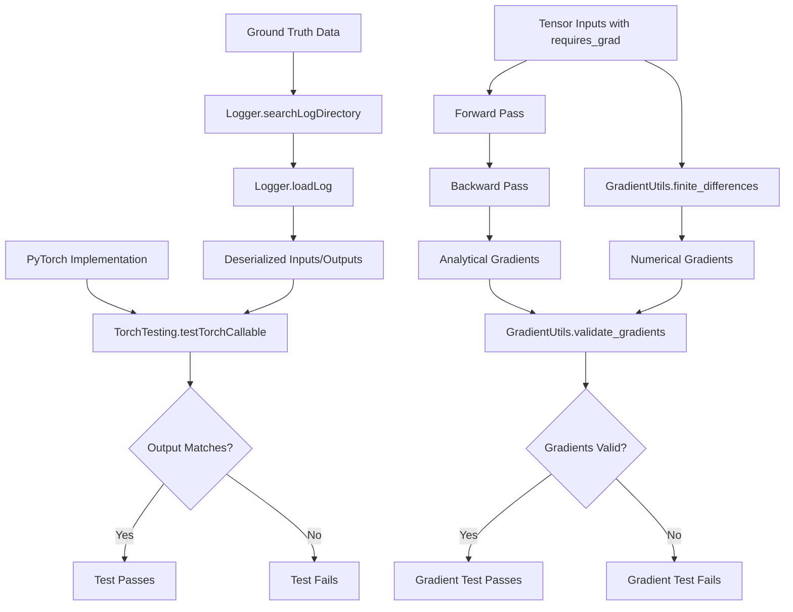

# PyTorch Port Architecture Overview

## Component Interaction Diagram

```mermaid
graph TD
    %% Data Sources
    PDB[PDB Files] --> AtomModel[AtomicModel]
    Config[Simulation Parameters] --> RunTorch

    %% Adapter Layer
    AtomModel --> PDBAdapter[PDBToTensor]
    PDBAdapter --> |Atom coordinates, form factors as tensors| TorchModel[PyTorch Models]
    
    %% Core Physics Layer 
    GridParams[Grid Parameters] --> GridAdapter[GridToTensor]
    GridAdapter --> |q-grid, resolution masks as tensors| MapUtils[map_utils_torch]
    
    %% Utility Components
    MapUtils --> |q-grid, symmetry info| ScatterCalc[scatter_torch]
    
    %% Complex Operations
    ComplexOps[ComplexTensorOps] --> |Complex exponentials, multiplication| ScatterCalc
    FFTOps[FFTOps] --> |FFT convolution| LiquidLike[LiquidLikeMotions Model]
    EigenOps[EigenOps] --> |Eigendecomposition| PhononCalc[Phonon Calculations]
    
    %% Structure Calculation
    ScatterCalc --> |Structure factors| OnePhonon[OnePhonon Model]
    ScatterCalc --> |Structure factors| RigidTrans[RigidBodyTranslations Model]
    ScatterCalc --> |Structure factors| RigidRot[RigidBodyRotations Model]
    ScatterCalc --> |Structure factors| LiquidLike
    
    %% Phonon Subsystem
    GNM[GaussianNetworkModel] --> |Hessian matrix| GNMTorch[GaussianNetworkModel_torch]
    GNMTorch --> |Differentiable matrices| PhononCalc
    PhononCalc --> |Phonon modes, frequencies| OnePhonon
    
    %% Model Outputs
    OnePhonon --> |Diffuse intensity tensor| ResultsAdapter[TensorToNumpy]
    RigidTrans --> |Diffuse intensity tensor| ResultsAdapter
    RigidRot --> |Diffuse intensity tensor| ResultsAdapter
    LiquidLike --> |Diffuse intensity tensor| ResultsAdapter
    
    %% Statistics and Reference 
    StatsTorch[stats_torch] --> |Correlation metrics| ModelEval[Model Evaluation]
    ReferenceTorch[reference_torch] --> |Alternative implementations| Validation[Implementation Validation]
    
    %% Output and Gradients
    ResultsAdapter --> |NumPy arrays| Output[Diffuse Intensity Map]
    GradUtils[GradientUtils] -.-> |Gradient validation| OnePhonon
    GradUtils -.-> |Gradient validation| RigidTrans
    GradUtils -.-> |Gradient validation| RigidRot
    GradUtils -.-> |Gradient validation| LiquidLike
    
    %% Testing Flow
    GroundTruth[Ground Truth Data] --> TestComp[TorchTesting]
    TestComp --> |Validation| TorchModel
    
    %% Execution Flow
    RunTorch[run_torch.py] --> OnePhonon
    RunTorch --> RigidTrans
    RunTorch --> RigidRot
    RunTorch --> LiquidLike
    
    %% Subcomponent details
    subgraph "Core Utilities (torch_utils.py)"
        ComplexOps
        FFTOps
        EigenOps
        GradUtils
    end
    
    subgraph "Adapter Components (adapters.py)"
        PDBAdapter
        GridAdapter
        ResultsAdapter
        ModelAdapters[ModelAdapters]
    end
    
    subgraph "Physics Calculations"
        MapUtils
        ScatterCalc
        PhononCalc
        GNMTorch
        StatsTorch
        ReferenceTorch
    end
    
    subgraph "Disorder Models (models_torch.py)"
        OnePhonon
        RigidTrans
        RigidRot
        LiquidLike
    end
    
    %% Test Framework
    subgraph "Testing Framework"
        GroundTruth --> |searchLogDirectory| Logger[Logger]
        Logger --> |loadLog| InputOutput[Inputs/Outputs]
        InputOutput --> TestCase[Test Case]
        TorchModel --> TestCase
        TestCase --> |compare| TestResult[Test Result]
        TorchModel --> GradTest[Gradient Testing]
        GradUtils --> GradTest
        GradTest --> GradResult[Gradient Validation]
    end
    
    %% Bidirectional flows
    ModelAdapters <--> OnePhonon
    ModelAdapters <--> RigidTrans
    ModelAdapters <--> RigidRot
    ModelAdapters <--> LiquidLike
```

## Component Descriptions

### Core Utilities (`torch_utils.py`)

#### ComplexTensorOps
- **Purpose**: Provides differentiable complex number operations for structure factor calculations
- **Key Methods**:
  - `complex_exp(phase)`: Computes e^(i*phase) returning (real, imaginary) parts
  - `complex_mul(a_real, a_imag, b_real, b_imag)`: Multiplies complex numbers preserving gradients
  - `complex_abs_squared(real, imag)`: Computes |z|² preserving gradients
  - `complex_exp_dwf(q_vec, u_vec)`: Computes Debye-Waller factor exp(-0.5*qUq)
- **Gradient Requirements**: All operations must support backpropagation

#### FFTOps
- **Purpose**: Provides differentiable FFT operations for convolution and signal processing
- **Key Methods**:
  - `fft_convolve(signal, kernel)`: Convolves signal with kernel using FFT
  - `fft_3d(input_tensor)`: Performs 3D FFT preserving gradients
  - `ifft_3d(input_tensor)`: Performs 3D inverse FFT preserving gradients
- **Used By**: LiquidLikeMotions model for diffuse scattering calculations

#### EigenOps
- **Purpose**: Provides differentiable eigendecomposition and related operations
- **Key Methods**:
  - `svd_decomposition(matrix)`: Computes SVD with gradient support
  - `eigen_decomposition(matrix)`: Computes eigenvalues/vectors with gradient support
  - `solve_linear_system(A, b)`: Solves Ax=b with gradient support
- **Used By**: Phonon calculations in OnePhonon model

#### GradientUtils
- **Purpose**: Validates gradients and provides gradient manipulation utilities
- **Key Methods**:
  - `finite_differences(func, input_tensor)`: Computes numerical gradients for validation
  - `validate_gradients(analytical_grad, numerical_grad)`: Compares analytical and numerical gradients
  - `gradient_norm(gradient)`: Computes L2 norm of gradients

### Adapter Components (`adapters.py`)

#### PDBToTensor
- **Purpose**: Converts AtomicModel and related data to PyTorch tensors
- **Key Methods**:
  - `convert_atomic_model(model)`: Converts AtomicModel to tensor dictionary
  - `convert_crystal(crystal)`: Converts Crystal to tensor dictionary
  - `convert_gnm(gnm)`: Converts GaussianNetworkModel to tensor dictionary
- **Gradient Requirements**: Preserves structure for backpropagation

#### GridToTensor
- **Purpose**: Converts grid data and related structures to PyTorch tensors
- **Key Methods**:
  - `convert_grid(q_grid, map_shape)`: Converts q_grid to tensor
  - `convert_mask(mask)`: Converts boolean mask to tensor
  - `convert_symmetry_ops(sym_ops)`: Converts symmetry operations to tensors
- **Gradient Requirements**: Grid points need gradients, masks typically don't

#### TensorToNumpy
- **Purpose**: Converts PyTorch tensors back to NumPy arrays
- **Key Methods**:
  - `tensor_to_array(tensor)`: Converts tensor to array
  - `convert_dict_of_tensors(dict_tensors)`: Converts dictionary of tensors to arrays
  - `convert_intensity_map(intensity, map_shape)`: Converts intensity map to NumPy
- **Gradient Requirements**: N/A (one-way conversion)

#### ModelAdapters
- **Purpose**: Provides model-specific conversion between NumPy and PyTorch
- **Key Methods**:
  - `adapt_one_phonon_inputs(np_model)`: Adapts OnePhonon inputs for PyTorch
  - `adapt_one_phonon_outputs(torch_outputs)`: Adapts PyTorch outputs back to NumPy
  - Similar methods for other model types
- **Gradient Requirements**: Must preserve model structure for backpropagation

### Physics Calculations

#### map_utils_torch (`map_utils_torch.py`)
- **Purpose**: Provides grid generation and related utilities
- **Key Methods**:
  - `generate_grid(A_inv, hsampling, ksampling, lsampling)`: Creates q-grid tensor
  - `get_symmetry_equivalents(hkl_grid, sym_ops)`: Gets symmetry equivalent indices
  - `compute_resolution(cell, hkl)`: Computes resolution in Angstroms
- **Gradient Requirements**: Grid generation must preserve gradients

#### scatter_torch (`scatter_torch.py`)
- **Purpose**: Provides structure factor calculations
- **Key Methods**:
  - `compute_form_factors(q_grid, ff_a, ff_b, ff_c)`: Computes atomic form factors
  - `structure_factors_batch(q_grid, xyz, ff_a, ff_b, ff_c)`: Batch structure factor calculation
  - `structure_factors(q_grid, xyz, ff_a, ff_b, ff_c)`: Overall structure factor calculation
- **Gradient Requirements**: Complex exponentials must preserve gradients

#### stats_torch (`stats_torch.py`)
- **Purpose**: Provides correlation calculations and statistical utilities
- **Key Methods**:
  - `compute_cc(arr1, arr2, mask)`: Computes correlation coefficient between arrays
  - `compute_cc_by_shell(arr1, arr2, res_map, mask)`: Computes CC by resolution shell
  - `compute_cc_by_dq(arr1, arr2, dq_map, mask)`: Computes CC by distance to Bragg peak
- **Gradient Requirements**: 
  - For metrics calculation: No gradients typically needed
  - For optimization objectives: Gradients needed from metrics to model outputs

#### reference_torch (`reference_torch.py`)
- **Purpose**: Alternative implementations for validation and comparison
- **Key Methods**:
  - `structure_factors(q_grid, xyz, elements)`: Reference structure factor calculation
  - `diffuse_covmat(q_grid, xyz, elements, V)`: Diffuse scattering from covariance matrix
- **Gradient Requirements**: Must preserve gradients for validation purposes
- **Usage**: For validation, testing, and comparison with primary implementations

#### GaussianNetworkModel_torch (part of `pdb_torch.py`)
- **Purpose**: PyTorch implementation of the Gaussian Network Model
- **Key Methods**:
  - `compute_hessian()`: Differentiable Hessian matrix calculation
  - `compute_K(hessian, kvec)`: Computes dynamical matrix with gradient support
  - `compute_Kinv(hessian, kvec)`: Computes inverse dynamical matrix with gradient support
- **Gradient Requirements**: Matrix operations must preserve gradients
- **NumPy/PyTorch Boundary**: 
  - Uses NumPy for non-differentiable operations (build_neighbor_list)
  - Uses PyTorch for differentiable physics calculations
  - Adapters manage conversion between representations

#### Phonon Calculations (part of `models_torch.py`)
- **Purpose**: Calculates phonon modes and frequencies
- **Key Methods**:
  - `compute_gnm_phonons()`: Computes phonon modes from GNM
  - `compute_hessian()`: Builds Hessian matrix
  - `compute_covariance_matrix()`: Computes atomic displacement covariances
- **Gradient Requirements**: Eigendecomposition must support backpropagation

### Disorder Models (`models_torch.py`)

#### OnePhonon
- **Purpose**: Models diffuse scattering from phonons
- **Key Methods**:
  - `_build_A()`, `_build_M()`: Build displacement and mass matrices
  - `compute_gnm_phonons()`: Compute phonon modes
  - `apply_disorder()`: Apply disorder to get diffuse intensity
- **Gradient Requirements**: End-to-end gradient flow from parameters to intensity

#### RigidBodyTranslations
- **Purpose**: Models disorder from rigid body translations
- **Key Methods**:
  - `apply_disorder(sigmas)`: Apply translational disorder
  - `optimize(target, sigmas_min, sigmas_max)`: Optimize disorder parameters
- **Gradient Requirements**: Gradients from intensity to sigma parameters

#### LiquidLikeMotions
- **Purpose**: Models liquid-like motion disorder
- **Key Methods**:
  - `fft_convolve(transform, kernel)`: Convolve with FFT
  - `apply_disorder(sigmas, gammas)`: Apply disorder with parameters
- **Gradient Requirements**: FFT convolution must preserve gradients

#### RigidBodyRotations
- **Purpose**: Models disorder from rigid body rotations
- **Key Methods**:
  - `generate_rotations_around_axis(sigma, num_rot)`: Generate rotation matrices
  - `apply_disorder(sigmas, num_rot)`: Apply rotational disorder
- **Gradient Requirements**: Rotation generation must preserve gradients

### Testing Framework

#### Logger
- **Purpose**: Handles ground truth data storage and retrieval
- **Key Methods**:
  - `searchLogDirectory(log_path_prefix)`: Finds relevant log files
  - `loadLog(log_file_path)`: Loads serialized inputs and outputs
- **Used By**: TorchTesting for accessing ground truth data

#### TorchTesting
- **Purpose**: Provides PyTorch-specific testing utilities
- **Key Methods**:
  - `testTorchCallable(log_path_prefix, torch_func)`: Tests PyTorch function against ground truth
  - `check_gradients(torch_func, inputs)`: Validates gradient computation
- **Used By**: Test scripts for validating PyTorch implementations

## Ground Truth Testing Strategy

### Component-to-Test Mapping

The following table maps PyTorch components to their corresponding ground truth data and testing approaches:

| PyTorch Component | Ground Truth Data | Testing Approach | Tolerances |
|-------------------|-------------------|------------------|------------|
| `ComplexTensorOps` | N/A (utility class) | Unit tests with known values | rtol=1e-5, atol=1e-8 |
| `EigenOps` | N/A (utility class) | Unit tests with known values | rtol=1e-5, atol=1e-8 |
| `map_utils_torch.generate_grid` | `logs/eryx.map_utils.generate_grid.log` | Compare grid outputs | rtol=1e-5, atol=1e-8 |
| `map_utils_torch.get_symmetry_equivalents` | `logs/eryx.map_utils.get_symmetry_equivalents.log` | Compare indices | exact match |
| `scatter_torch.compute_form_factors` | `logs/eryx.scatter.compute_form_factors.log` | Compare form factors | rtol=1e-4, atol=1e-7 |
| `scatter_torch.structure_factors_batch` | `logs/eryx.scatter.structure_factors_batch.log` | Compare structure factors | rtol=1e-4, atol=1e-7 |
| `models_torch.OnePhonon.compute_gnm_phonons` | `logs/eryx.models.OnePhonon.compute_gnm_phonons.log` | Compare eigenvalues and vectors | rtol=1e-4, atol=1e-6 |
| `models_torch.OnePhonon.apply_disorder` | `logs/eryx.models.OnePhonon.apply_disorder.log` | Compare diffuse intensity | rtol=1e-3, atol=1e-5 |

For eigendecomposition and FFT operations, larger tolerances may be needed due to numerical differences between NumPy and PyTorch implementations.

### Testing Flow Diagram

## Key Data Flows

### 1. Data Initialization Flow
- **PDB Files → AtomicModel → PDBToTensor → PyTorch Models**
  - PDB files provide raw structural data
  - AtomicModel processes this into a structured object
  - PDBToTensor converts to differentiable tensor representation
  - PyTorch models receive tensor data with gradient capability
  - **Critical for gradient flow**: Preserving relationships between atoms

### 2. Grid Generation Flow
- **Grid Parameters → GridToTensor → map_utils_torch → Physics Calculations**
  - Grid parameters define the reciprocal space sampling
  - GridToTensor converts these to tensor representations
  - map_utils_torch generates differentiable q-grid tensors
  - Physics calculations use these for structure factor calculations
  - **Critical for gradient flow**: Maintaining correct q-vector derivatives

### 3. Structure Factor Calculation Flow
- **Atomic Data + q-grid → ComplexTensorOps + scatter_torch → Structure Factors**
  - Atomic coordinates and form factors combine with q-grid
  - ComplexTensorOps provides differentiable complex number operations
  - scatter_torch computes structure factors with gradient preservation
  - Structure factors feed into disorder models
  - **Critical for gradient flow**: Complex exponentials and Debye-Waller factors

### 4. Phonon Calculation Flow
- **GaussianNetworkModel → GaussianNetworkModel_torch → Phonon Calculations → OnePhonon Model**
  - GNM provides spring constants and connectivity
  - GaussianNetworkModel_torch provides differentiable matrix operations
  - EigenOps enables differentiable eigendecomposition
  - Phonon calculations compute modes and frequencies
  - OnePhonon model uses these for diffuse scattering
  - **Critical for gradient flow**: Eigendecomposition with backpropagation

### 5. Model Execution Flow
- **run_torch.py → Disorder Models → TensorToNumpy → Output Map**
  - run_torch.py initializes parameters and models
  - Disorder models perform physics calculations
  - TensorToNumpy converts results back to NumPy arrays
  - Output maps represent diffuse scattering intensity
  - **Critical for gradient flow**: End-to-end parameter to output gradient path

### 6. Gradient Validation Flow
- **Models → GradientUtils → Numerical Validation**
  - Models compute diffuse scattering with gradient tracking
  - GradientUtils computes numerical gradients via finite differences
  - Comparison validates analytical gradient implementation
  - **Critical for validation**: Appropriate tolerance selection

### 7. Testing Flow
- **Ground Truth Data → TorchTesting → Model Validation**
  - Ground truth data from NumPy implementation provides reference
  - TorchTesting compares PyTorch outputs to ground truth
  - Validates both correctness and gradient computation
  - **Critical for quality**: Proper tolerance selection for comparisons

## Ground Truth Generation Strategy

1. **Direct Decoration with @debug**
   - Original NumPy functions directly decorated with `@debug` decorator
   - No wrapper functions or duplicate implementations
   - Import statement (`from eryx.autotest.debug import debug`) added to each file
   - Ground truth captured with original NumPy implementations

2. **Ground Truth Data Collection**
   - Running `run_np()` with varied parameter sets
   - `@debug` decorator automatically captures inputs/outputs to logs
   - Multiple parameter configurations ensure comprehensive coverage
   - Logs stored in standardized directory structure

3. **Ground Truth Validation**
   - Verification script checks log completeness
   - Ensures all functions in to_convert.json have logs
   - Confirms all inputs/outputs properly captured
   - Summary report highlights any missing data

4. **Testing Against Ground Truth**
   - PyTorch implementations run with same inputs from logs
   - Outputs compared against NumPy results with appropriate tolerances
   - Both correctness and gradient computation validated
   - Comprehensive test suite ensures all components verified

## Critical Differentiability Points

1. **Complex Operations in Structure Factors**
   - **Challenge**: Maintaining gradient flow through complex exponentials
   - **Solution**: Implement ComplexTensorOps with explicit real/imaginary parts 
   - **Components affected**: scatter_torch.py, structure_factors_batch
   - **Implementation approach**: Use separate real and imaginary tensors with PyTorch autograd

2. **Eigendecomposition in Phonon Calculations**
   - **Challenge**: PyTorch's eigendecomposition has limited gradient support
   - **Solution**: Use SVD-based approach with manual gradient implementation where needed
   - **Components affected**: OnePhonon.compute_gnm_phonons(), EigenOps
   - **Implementation approach**: Leverage torch.svd with careful handling of degenerate eigenvalues

3. **FFT Operations in LiquidLikeMotions**
   - **Challenge**: Ensuring gradient flow through FFT operations
   - **Solution**: Use PyTorch's native FFT functions with proper normalization
   - **Components affected**: LiquidLikeMotions.fft_convolve(), FFTOps
   - **Implementation approach**: Use torch.fft module with explicit handling of complex tensors

4. **Adapter Conversions**
   - **Challenge**: Preserving gradient information during conversions
   - **Solution**: Careful design of adapter APIs to maintain computational graph
   - **Components affected**: All adapter classes in adapters.py
   - **Implementation approach**: Ensure tensor conversions retain requires_grad and device placement

5. **Batching and Memory Management**
   - **Challenge**: Handling large datasets while preserving gradient flow
   - **Solution**: Implement efficient batching strategy with gradient accumulation
   - **Components affected**: structure_factors(), OnePhonon.apply_disorder()
   - **Implementation approach**: Use torch.no_grad() strategically, accumulate gradients across batches

## Implementation Guidelines

1. **Tensor Shape Documentation**
   - All methods should document input and output tensor shapes
   - Example: `# Input shape: (N, 3), Output shape: (N, M, 3)`

2. **Type Annotation**
   - Use full type hints for all function parameters and return values
   - Use `torch.Tensor` instead of `np.ndarray` for tensor arguments
   - Use `Optional[torch.Tensor]` for parameters that can be None
   - Use `Union[Type1, Type2]` for parameters with multiple possible types
   - Include shape information in type documentation comments
   - Example: `def func(x: torch.Tensor, y: Optional[torch.Tensor] = None) -> torch.Tensor:`

3. **Device Placement**
   - Use consistent device placement across component boundaries
   - Accept device parameter in all component initializers
   - Default to CUDA if available, CPU otherwise
   - Example: `device = torch.device('cuda' if torch.cuda.is_available() else 'cpu')`

4. **Gradient Status**
   - Document which tensors require gradients and which don't
   - Validate input tensor requires_grad status where appropriate
   - Use requires_grad=False for constant tensors to optimize memory
   - Example: `tensor.requires_grad_(True)  # Enable gradients`

5. **Error Handling**
   - Error handling should preserve the backpropagation chain
   - Use appropriate error types for different failure modes
   - Include tensor shapes in error messages
   - Example: `raise ValueError(f"Expected shape {expected_shape}, got {tensor.shape}")`

6. **Memory Optimization**
   - Release intermediate tensors when no longer needed
   - Use in-place operations where appropriate (when not breaking gradient flow)
   - Consider checkpoint-based backpropagation for large models
   - Example: `del intermediate_tensor  # Free memory`

7. **Numerical Stability**
   - Add small epsilon values to denominators to avoid division by zero
   - Use logarithmic space for operations prone to overflow/underflow
   - Handle potential NaN/Inf values gracefully
   - Example: `result = value / (denominator + 1e-10)  # Avoid division by zero`
