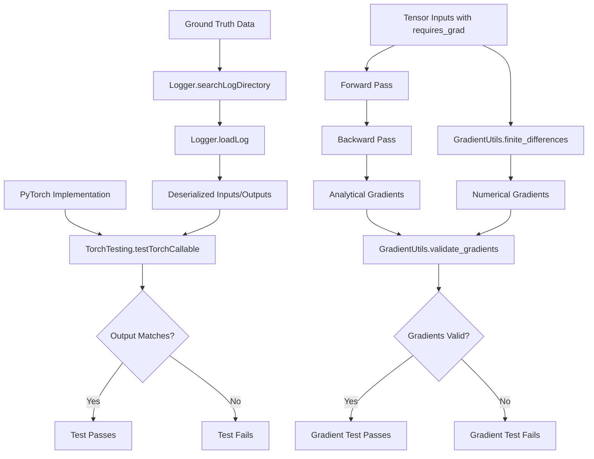
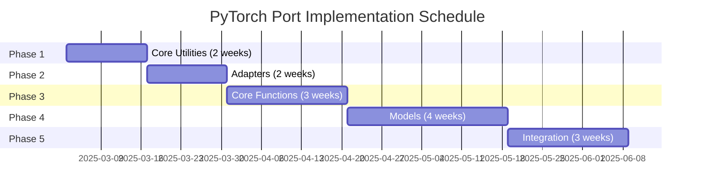

# Updated Phased Implementation Plan for PyTorch Port

## Overview and Resources

This document outlines the implementation plan for the PyTorch port of the diffuse scattering simulation codebase. For comprehensive information about the architecture and component interactions, refer to the following resources:

- **Component Architecture**: [Architecture Document](./architecture.md) provides detailed component descriptions and interactions
- **Implementation Tasks**: [TODOS Document](./TODOS.md) contains detailed checklists for each component
- **Code Standards**: [Project Rules](./project_rules.md) specifies requirements for implementation
- **Ground Truth Data**: Located in `logs/` directory, generated via `@debug` decorators

## Current Status Overview

- **Completed**: Most PyTorch stub files have been created with placeholders, docstrings, and type hints.
- **Generated**: Ground truth data for 22 components has been captured using `@debug` decorators.
- **Not Started**: Core implementation of differentiable operations, adapters, and model components.

## Ground Truth Testing Strategy

### Data Storage and Access
Ground truth data is stored in the `logs/` directory, with each function's inputs and outputs captured via the `@debug` decorator. Each log file follows the naming convention `logs/eryx.module.function.log` and contains serialized inputs and expected outputs.

### Accessing Ground Truth Data
The testing framework accesses ground truth data through the following process:
1. Use `Logger.searchLogDirectory()` to find relevant log files for a component
2. Use `Logger.loadLog()` to deserialize input/output pairs for testing
3. Feed inputs through the PyTorch implementation and compare outputs

### Testing Framework
The `TorchTesting` class in `eryx/autotest/torch_testing.py` provides specialized methods for testing PyTorch implementations:
- `testTorchCallable(log_path_prefix, torch_func)`: Tests a PyTorch function against NumPy ground truth
- `create_tensor_test_case(log_path_prefix, torch_func, numpy_func)`: Creates complete test cases
- `check_gradients(torch_func, inputs)`: Validates gradient computation

### Test Execution Process
For each PyTorch component:
1. Find all ground truth logs for the corresponding NumPy function
2. Convert inputs from NumPy arrays to PyTorch tensors
3. Pass inputs to the PyTorch implementation
4. Convert outputs back to NumPy for comparison
5. Verify outputs match within specified tolerances
6. (For differentiable components) Validate gradient computation

### Component-to-Test Mapping

The following table maps PyTorch components to their corresponding ground truth data and testing approaches:

| PyTorch Component | Ground Truth Data | Testing Approach | Tolerances |
|-------------------|-------------------|------------------|------------|
| `ComplexTensorOps` | N/A (utility class) | Unit tests with known values | rtol=1e-5, atol=1e-8 |
| `EigenOps` | N/A (utility class) | Unit tests with known values | rtol=1e-5, atol=1e-8 |
| `map_utils_torch.generate_grid` | `logs/eryx.map_utils.generate_grid.log` | Compare grid outputs | rtol=1e-5, atol=1e-8 |
| `map_utils_torch.get_symmetry_equivalents` | `logs/eryx.map_utils.get_symmetry_equivalents.log` | Compare indices | exact match |
| `scatter_torch.compute_form_factors` | `logs/eryx.scatter.compute_form_factors.log` | Compare form factors | rtol=1e-4, atol=1e-7 |
| `scatter_torch.structure_factors_batch` | `logs/eryx.scatter.structure_factors_batch.log` | Compare structure factors | rtol=1e-4, atol=1e-7 |
| `models_torch.OnePhonon.compute_gnm_phonons` | `logs/eryx.models.OnePhonon.compute_gnm_phonons.log` | Compare eigenvalues and vectors | rtol=1e-4, atol=1e-6 |
| `models_torch.OnePhonon.apply_disorder` | `logs/eryx.models.OnePhonon.apply_disorder.log` | Compare diffuse intensity | rtol=1e-3, atol=1e-5 |

For eigendecomposition and FFT operations, larger tolerances may be needed due to numerical differences between NumPy and PyTorch implementations.

## System Boundaries and Differentiability Constraints

Based on the [Architecture Component Diagram](./architecture.md#component-interaction-diagram), we distinguish between components that should remain in NumPy and those that should be converted to PyTorch with differentiability:

### Non-Differentiable Components (Keep in NumPy)
- **Data Loading**: PDB loading, cell parameter extraction, symmetry operations
- **Preprocessing**: Frame extraction, form factor extraction, neighbor list construction
- **Postprocessing**: Result saving, visualization, statistical analysis

### Differentiable Components (Convert to PyTorch)
- **Core Physics Simulation**: Matrix construction, Hessian computation, phonon calculations
- **Structure Factor Calculation**: Form factors, structure factors, complex operations
- **Model Application**: Disorder models (OnePhonon, RigidBodyTranslations, etc.)
- **Grid Operations**: Grid generation, symmetry operations, Fourier transforms

## Revised Implementation Plan

### Phase 1: Core Utilities Implementation (2 weeks)

#### Task 1.1: Implement ComplexTensorOps in torch_utils.py
- Implement differentiable complex exponential for phase calculations
- Implement complex multiplication with gradient preservation
- Implement complex absolute square value calculation
- Implement Debye-Waller factor calculation
- Add comprehensive tests verifying gradient flow

**Component Interactions:**
- Output used by: scatter_torch.structure_factors_batch
- Critical for: Phase calculations, structure factors
- Gradient flow: Must support backpropagation through complex operations

**Testing Approach:**
- Unit tests with known input/output values (e.g., e^(iπ/2) = i)
- Gradient validation using finite differences
- No ground truth data needed (pure utility class)

**References:**
- **Component Details**: [Architecture: ComplexTensorOps](./architecture.md#complextensorops)
- **Implementation Checklist**: [TODOS: ComplexTensorOps Class](./TODOS.md#complextensorops-class)
- **Differentiability Approach**: [Architecture: Complex Operations Critical Point](./architecture.md#critical-differentiability-points)

#### Task 1.2: Implement EigenOps in torch_utils.py
- Implement SVD-based approach for eigenvalue decomposition
- Implement proper gradient handling for degenerate eigenvalues
- Implement linear system solver with gradient support
- Document gradient flow limitations and stability considerations

**Component Interactions:**
- Output used by: OnePhonon.compute_gnm_phonons()
- Critical for: Phonon mode calculation, covariance matrix
- Gradient flow: Must support backpropagation through eigendecomposition

**Testing Approach:**
- Unit tests with known matrices and their eigendecomposition
- Gradient validation using finite differences
- No ground truth data needed (pure utility class)

**References:**
- **Component Details**: [Architecture: EigenOps](./architecture.md#eigenops)
- **Implementation Checklist**: [TODOS: EigenOps Class](./TODOS.md#eigenops-class)
- **Differentiability Approach**: [Architecture: Eigendecomposition Critical Point](./architecture.md#critical-differentiability-points)
- **Data Flow**: [Architecture: Phonon Calculation Flow](./architecture.md#4-phonon-calculation-flow)

#### Task 1.3: Implement FFTOps in torch_utils.py
- Implement differentiable FFT convolution for LiquidLikeMotions model
- Create helpers for complex FFT operations with gradient preservation
- Ensure proper normalization that preserves gradients
- Test with various input sizes and boundary conditions

**Component Interactions:**
- Output used by: LiquidLikeMotions.fft_convolve()
- Critical for: Liquid-like motion disorder calculations
- Gradient flow: Must preserve gradients through FFT operations

**Testing Approach:**
- Unit tests comparing with NumPy FFT results
- Gradient validation through convolution operations
- No ground truth data needed (pure utility class)

**References:**
- **Component Details**: [Architecture: FFTOps](./architecture.md#fftops)
- **Implementation Checklist**: [TODOS: FFTOps Class](./TODOS.md#fftops-class)
- **Differentiability Approach**: [Architecture: FFT Operations Critical Point](./architecture.md#critical-differentiability-points)

#### Task 1.4: Implement GradientUtils in torch_utils.py
- Create finite difference validation tools
- Implement gradient norm calculations
- Add gradient visualization helpers
- Document validation methodology and appropriate tolerances

**Component Interactions:**
- Used for: Validating gradients in all model components
- Critical for: Verifying analytical gradient implementations
- Flow: Compare analytical gradients with numerical approximations

**Testing Approach:**
- Unit tests with simple functions with known gradients
- Test gradient computation accuracy with different step sizes
- No ground truth data needed (pure utility class)

**References:**
- **Component Details**: [Architecture: GradientUtils](./architecture.md#gradientutils)
- **Implementation Checklist**: [TODOS: GradientUtils Class](./TODOS.md#gradientutils-class)
- **Validation Strategy**: [Architecture: Gradient Validation Flow](./architecture.md#6-gradient-validation-flow)

### Phase 2: Adapter Implementation (2 weeks)

#### Task 2.1: Implement PDBToTensor in adapters.py
- Implement convert_atomic_model() method with specific tensor conversions
- Implement convert_crystal() and convert_gnm() methods
- Support explicit device placement with proper defaults
- Add comprehensive docstrings describing tensor shapes and types

**Component Interactions:**
- Input from: AtomicModel, Crystal, GaussianNetworkModel
- Output to: PyTorch model implementations
- Critical conversions: Coordinates, form factors, cell parameters
- Gradient flow: Preserve structure for backpropagation

**Testing Approach:**
- Unit tests with sample PDB data
- Verify correct conversion of arrays to tensors
- Test device placement and gradient enablement
- No ground truth data needed (pure utility class)

**References:**
- **Component Details**: [Architecture: PDBToTensor](./architecture.md#pdbtotensor)
- **Implementation Checklist**: [TODOS: PDBToTensor Class](./TODOS.md#pdbtotensor-class)
- **Data Flow**: [Architecture: Data Initialization Flow](./architecture.md#1-data-initialization-flow)
- **Device Management**: [Project Rules: Device Management](./project_rules.md#device-management)

#### Task 2.2: Implement GridToTensor in adapters.py
- Implement convert_grid() method with gradient preservation
- Implement convert_mask() and convert_symmetry_ops() methods
- Document which components need to be differentiable
- Add tests verifying conversion correctness and gradient preservation

**Component Interactions:**
- Input from: Grid parameters, resolution masks
- Output to: map_utils_torch functions
- Critical conversions: q-grid, symmetry operations
- Gradient flow: Grid points need gradients, masks typically don't

**Testing Approach:**
- Unit tests with sample grid data
- Verify correct conversion of arrays to tensors
- Test propagation of requires_grad property
- No ground truth data needed (pure utility class)

**References:**
- **Component Details**: [Architecture: GridToTensor](./architecture.md#gridtotensor)
- **Implementation Checklist**: [TODOS: GridToTensor Class](./TODOS.md#gridtotensor-class)
- **Data Flow**: [Architecture: Grid Generation Flow](./architecture.md#2-grid-generation-flow)

#### Task 2.3: Implement TensorToNumpy in adapters.py
- Implement tensor_to_array() with proper detachment
- Implement convert_dict_of_tensors() and convert_intensity_map()
- Document shape handling and any detach/clone operations
- Add tests for various tensor types and shapes

**Component Interactions:**
- Input from: PyTorch model outputs
- Output to: NumPy arrays for visualization
- Critical conversions: Intensity maps, statistics
- Gradient flow: N/A (one-way conversion)

**Testing Approach:**
- Unit tests with various tensor shapes and types
- Verify correct detachment and CPU conversion
- Test handling of complex tensors and nested structures
- No ground truth data needed (pure utility class)

**References:**
- **Component Details**: [Architecture: TensorToNumpy](./architecture.md#tensortonumpy)
- **Implementation Checklist**: [TODOS: TensorToNumpy Class](./TODOS.md#tensortonumpy-class)
- **Output Flow**: [Architecture: Model Execution Flow](./architecture.md#5-model-execution-flow)

#### Task 2.4: Implement ModelAdapters in adapters.py
- Implement model-specific adapters for each disorder model type
- Document specific tensor shape and gradient requirements
- Add bidirectional conversion tests
- Verify gradient preservation across conversions

**Component Interactions:**
- Bidirectional flow with: OnePhonon, RigidBodyTranslations, etc.
- Critical conversions: Model parameters, intermediate results
- Gradient flow: Must preserve model structure for optimization

**Testing Approach:**
- Unit tests with mock model structures
- Test bidirectional conversion accuracy
- Verify gradient preservation through conversion
- No ground truth data needed (pure utility class)

**References:**
- **Component Details**: [Architecture: ModelAdapters](./architecture.md#modeladapters)
- **Implementation Checklist**: [TODOS: ModelAdapters Class](./TODOS.md#modeladapters-class)
- **Model Interfaces**: [Architecture: Disorder Models](./architecture.md#disorder-models-models_torchpy)

### Phase 3: Core Function Implementation (3 weeks)

#### Task 3.1: Implement map_utils_torch.py
- Implement generate_grid() using PyTorch tensor operations
- Implement get_symmetry_equivalents() and get_ravel_indices()
- Implement compute_resolution() and get_resolution_mask()
- Ensure all functions preserve gradient information

**Component Interactions:**
- Input from: GridToTensor adapter
- Output to: scatter_torch, disorder models
- Critical operations: Grid generation, symmetry handling
- Gradient flow: Must preserve q-vector derivatives

**Testing Approach:**
- Test against ground truth data in `logs/eryx.map_utils.*.log`
- Use `TorchTesting.testTorchCallable()` with appropriate tolerances
- Add gradient validation for differentiable functions
- Test performance with large grid sizes

**References:**
- **Component Details**: [Architecture: map_utils_torch](./architecture.md#map_utils_torch-map_utils_torchpy)
- **Implementation Checklist**: [TODOS: Map Utilities Implementation](./TODOS.md#3-map-utilities-implementation-map_utils_torchpy)
- **Type Annotation Guidelines**: [Architecture: Type Annotation](./architecture.md#implementation-guidelines)
- **Ground Truth Generation**: [Architecture: Ground Truth Generation Strategy](./architecture.md#ground-truth-generation-strategy)

#### Task 3.2: Implement scatter_torch.py
- Implement compute_form_factors() using ComplexTensorOps
- Implement structure_factors_batch() with gradient preservation
- Implement structure_factors() with efficient batching
- Document tensor shapes and gradient requirements

**Component Interactions:**
- Uses: ComplexTensorOps for complex operations
- Input from: PDBToTensor (atomic data), map_utils_torch (q-grid)
- Output to: OnePhonon, RigidBodyTranslations, etc.
- Gradient flow: Through complex exponentials and phase factors

**Testing Approach:**
- Test against ground truth data in `logs/eryx.scatter.*.log`
- Use `TorchTesting.testTorchCallable()` with specific tolerances (rtol=1e-4, atol=1e-7)
- Test with various batch sizes and input configurations
- Verify gradient flow through complex number operations

**References:**
- **Component Details**: [Architecture: scatter_torch](./architecture.md#scatter_torch-scatter_torchpy)
- **Implementation Checklist**: [TODOS: Structure Factor Calculation](./TODOS.md#4-structure-factor-calculation-implementation-scatter_torchpy)
- **Data Flow**: [Architecture: Structure Factor Calculation Flow](./architecture.md#3-structure-factor-calculation-flow)
- **Memory Optimization**: [Architecture: Implementation Guidelines](./architecture.md#implementation-guidelines)

#### Task 3.3: Implement base_torch.py
- Implement compute_molecular_transform() with gradient preservation
- Implement compute_crystal_transform() with proper symmetry handling
- Implement incoherent_sum functions with PyTorch operations
- Document transformation operations with gradient considerations

**Component Interactions:**
- Input from: PDBToTensor, map_utils_torch
- Uses: scatter_torch for structure factors
- Output to: Disorder models
- Gradient flow: Through transform calculations

**Testing Approach:**
- Test against ground truth data in `logs/eryx.base.*.log`
- Use `TorchTesting.testTorchCallable()` with appropriate tolerances
- Test with different symmetry operations and sampling rates
- Verify gradient flow through transform calculations

**References:**
- **Implementation Checklist**: [TODOS: Transform Implementation](./TODOS.md#5-transform-implementation-base_torchpy)
- **Original Implementation**: Check base.py for transform calculations
- **Error Handling Guidelines**: [Architecture: Error Handling](./architecture.md#implementation-guidelines)

### Phase 4: Model Implementation (4 weeks)

#### Task 4.1: Implement OnePhonon in models_torch.py
- Implement matrix construction methods (_build_A, _build_M)
- Implement compute_gnm_phonons() using EigenOps
- Implement compute_covariance_matrix() with gradient preservation
- Implement apply_disorder() with end-to-end gradient flow
- Add extensive documentation on tensor shapes and grad requirements

**Component Interactions:**
- Input from: PDBToTensor (atomic data), GridToTensor (grid data)
- Uses: scatter_torch, EigenOps, ComplexTensorOps
- Output to: TensorToNumpy (diffuse intensity)
- Gradient flow: From model parameters to diffuse intensity

**Testing Approach:**
- Test against ground truth data in `logs/eryx.models.OnePhonon.*.log`
- Use `TorchTesting.testTorchCallable()` with specific tolerances for eigendecomposition (rtol=1e-4, atol=1e-6)
- Test with different parameter sets from ground truth data
- Verify end-to-end gradient flow from parameters to intensity

**References:**
- **Component Details**: [Architecture: OnePhonon](./architecture.md#onephonon)
- **Implementation Checklist**: [TODOS: OnePhonon Model Implementation](./TODOS.md#6-onephonon-model-implementation-models_torchpy)
- **Data Flow**: [Architecture: Phonon Calculation Flow](./architecture.md#4-phonon-calculation-flow)
- **Critical Differentiability**: [Architecture: Eigendecomposition Critical Point](./architecture.md#critical-differentiability-points)
- **Memory Management**: [Architecture: Batching and Memory Management](./architecture.md#critical-differentiability-points)

#### Task 4.2: Implement RigidBodyTranslations in models_torch.py
- Implement core setup methods with tensor operations
- Implement apply_disorder() with gradient flow to sigmas
- Implement optimize() with gradient-based optimization option
- Document tensor operations and parameter gradients

**Component Interactions:**
- Input from: PDBToTensor, GridToTensor
- Uses: scatter_torch, ComplexTensorOps
- Output to: TensorToNumpy
- Gradient flow: From sigma parameters to diffuse intensity

**Testing Approach:**
- Test against ground truth data in `logs/eryx.models.RigidBodyTranslations.*.log`
- Use `TorchTesting.testTorchCallable()` with appropriate tolerances
- Test optimization with gradient-based approach
- Compare with NumPy optimization results

**References:**
- **Component Details**: [Architecture: RigidBodyTranslations](./architecture.md#rigidbodytranslations)
- **Implementation Checklist**: [TODOS: RigidBodyTranslations Model Implementation](./TODOS.md#7-rigidbodytranslations-model-implementation-models_torchpy)
- **Type Annotation Guidelines**: [Architecture: Type Annotation](./architecture.md#implementation-guidelines)

#### Task 4.3: Implement LiquidLikeMotions in models_torch.py
- Implement fft_convolve() using FFTOps
- Implement apply_disorder() with gradient preservation
- Implement optimize() with gradient-based options
- Document FFT-based calculations and gradient flow

**Component Interactions:**
- Input from: PDBToTensor, GridToTensor
- Uses: scatter_torch, FFTOps, ComplexTensorOps
- Output to: TensorToNumpy
- Gradient flow: Through FFT convolutions and parameter scaling

**Testing Approach:**
- Test against ground truth data in `logs/eryx.models.LiquidLikeMotions.*.log`
- Use `TorchTesting.testTorchCallable()` with appropriate tolerances
- Test with various kernel sizes and parameter sets
- Verify gradient flow through FFT operations

**References:**
- **Component Details**: [Architecture: LiquidLikeMotions](./architecture.md#liquidlikemotions)
- **Implementation Checklist**: [TODOS: LiquidLikeMotions Model Implementation](./TODOS.md#8-liquidlikemotions-model-implementation-models_torchpy)
- **Critical Differentiability**: [Architecture: FFT Operations Critical Point](./architecture.md#critical-differentiability-points)
- **Numerical Stability**: [Architecture: Numerical Stability](./architecture.md#implementation-guidelines)

#### Task 4.4: Implement RigidBodyRotations in models_torch.py
- Implement generate_rotations_around_axis() with gradient support
- Implement apply_disorder() with proper ensemble handling
- Document rotational gradient considerations
- Implement optimize() with gradient-based option

**Component Interactions:**
- Input from: PDBToTensor, GridToTensor
- Uses: scatter_torch, ComplexTensorOps
- Output to: TensorToNumpy
- Gradient flow: Through rotation generation and application

**Testing Approach:**
- Test against ground truth data in `logs/eryx.models.RigidBodyRotations.*.log`
- Use `TorchTesting.testTorchCallable()` with appropriate tolerances
- Test with various rotation parameters
- Verify gradient flow through rotation operations

**References:**
- **Component Details**: [Architecture: RigidBodyRotations](./architecture.md#rigidbodyrotations)
- **Implementation Checklist**: [TODOS: RigidBodyRotations Model Implementation](./TODOS.md#9-rigidbodyrotations-model-implementation-models_torchpy)
- **Device Placement Guidelines**: [Architecture: Device Placement](./architecture.md#implementation-guidelines)

### Phase 5: Integration and Testing (3 weeks)

#### Task 5.1: Implement run_torch.py
- Create end-to-end simulation script mirroring run_debug.py
- Add device management and error handling
- Implement gradient-based parameter optimization examples
- Document workflow with tensor operations

**Component Interactions:**
- Inputs: Simulation parameters, PDB files
- Uses: All PyTorch model implementations
- Output: Diffuse intensity maps
- Demonstrates: End-to-end gradient flow

**Testing Approach:**
- Compare end-to-end output with NumPy implementation
- Verify matching output with ground truth data
- Test with different parameter configurations
- Benchmark performance against NumPy implementation

**References:**
- **Implementation Checklist**: [TODOS: Integration and Testing](./TODOS.md#10-integration-and-testing)
- **Model Execution Flow**: [Architecture: Model Execution Flow](./architecture.md#5-model-execution-flow)
- **Error Handling Guidelines**: [Architecture: Error Handling](./architecture.md#implementation-guidelines)

#### Task 5.2: Implement Comprehensive Testing
- Create component-level tests for all implementations
- Add gradient validation tests using GradientUtils
- Implement integration tests across component boundaries
- Add performance benchmarks comparing NumPy and PyTorch versions

**Component Interactions:**
- Tests: All component interactions in the architecture
- Uses: Ground truth data from NumPy implementation
- Validates: Correctness and gradient computation
- Ensures: Compatibility across component boundaries

**Testing Approach:**
- Create test modules for each component
- Use test template for ground truth validation
- Add specific gradient tests for differentiable components
- Test end-to-end workflow with various configurations

**References:**
- **Testing Approach**: [Architecture: Testing Flow](./architecture.md#7-testing-flow)
- **Ground Truth Strategy**: [Architecture: Ground Truth Generation Strategy](./architecture.md#ground-truth-generation-strategy)
- **Testing Requirements**: [Project Rules: Ground Truth and Testing](./project_rules.md#ground-truth-and-testing)

#### Task 5.3: Optimize Performance
- Implement memory optimization strategies
- Add strategic use of torch.no_grad() where appropriate
- Implement batching with gradient accumulation
- Add device-specific optimizations (CPU/GPU)

**Component Interactions:**
- Optimizes: All performance-critical components
- Focuses on: OnePhonon.apply_disorder(), structure_factors()
- Balances: Memory usage vs. computation speed
- Preserves: Gradient flow through all operations

**Testing Approach:**
- Benchmark before and after optimizations
- Verify output consistency with optimizations
- Test with both CPU and GPU configurations
- Measure memory usage with profiling tools

**References:**
- **Performance Considerations**: [Project Rules: Performance Considerations](./project_rules.md#performance-considerations)
- **Memory Optimization**: [Architecture: Memory Optimization](./architecture.md#implementation-guidelines)
- **Batching Approaches**: [Architecture: Batching and Memory Management](./architecture.md#critical-differentiability-points)

## Implementation Priorities

Based on the component interactions diagram and critical differentiability points:

1. **ComplexTensorOps**: Foundation for structure factor calculations
2. **EigenOps**: Critical for phonon calculations in OnePhonon
3. **PDBToTensor and GridToTensor**: Needed for proper input representation
4. **scatter_torch**: Core for all disorder models
5. **OnePhonon model**: Most complex model with eigendecomposition challenges
6. **Alternative models**: Built on the foundation of the above components

## Timeline and Dependencies

- **Phase 1 (2 weeks)**: Core Utilities - Can start immediately with ground truth data
- **Phase 2 (2 weeks)**: Adapters - Depends on Phase 1 for tensor operations
- **Phase 3 (3 weeks)**: Core Functions - Depends on Phases 1-2
- **Phase 4 (4 weeks)**: Models - Depends on Phases 1-3
- **Phase 5 (3 weeks)**: Integration - Depends on all previous phases

**Total Timeline: 14 weeks**

## Testing Flow Diagram

## Critical Validation Points

Throughout all phases, we need to validate:

1. **Output Correctness**: PyTorch results match NumPy ground truth
2. **Gradient Correctness**: Analytical gradients match numerical approximations
3. **Memory Efficiency**: Implementation scales to realistic problem sizes
4. **Numerical Stability**: Results are stable across parameter ranges
5. **Device Compatibility**: Implementation works correctly on both CPU and GPU

## Implementation Sequence

